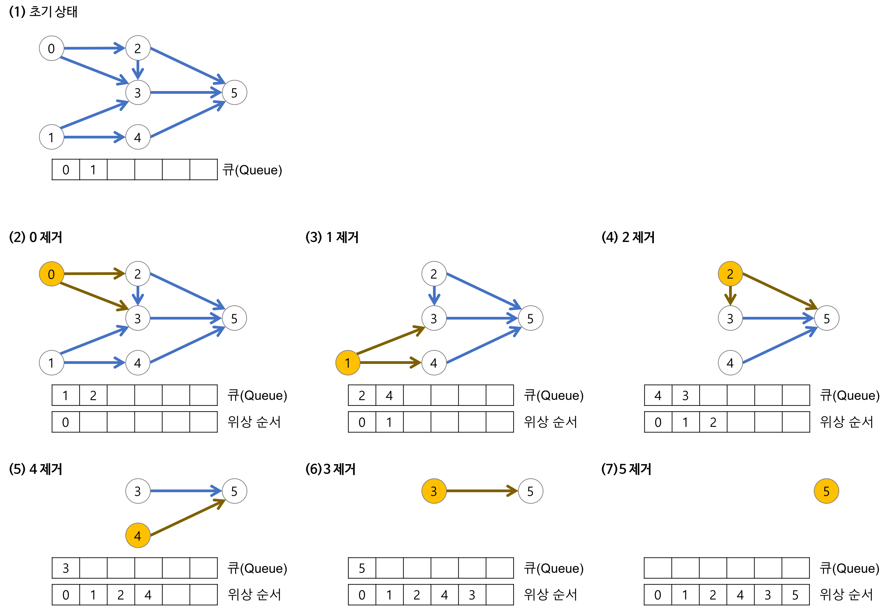

### 위상 정렬

위상정렬은 정점에 대해 들어오는 간선 개수인 inorder 개수가 0인 간선들부터 탐색을 시작한다.
다음 그림이 위상정렬의 과정을 확실히 설명하고 있다.



(출처 : https://gmlwjd9405.github.io/2018/08/27/algorithm-topological-sort.html)


그림과 같이 queue로 풀면 매우 직관적이라 알아보기가 쉽다.
inorder가 0인 것을 queue에 계속 넣으면서 현재 정점의 indegree를 하나씩 감소시키고 연결된 정점들을 queue에 넣을지 (indegree가 0인지 확인) 판단하며 진행한다.

stack으로 푸는 방법도 있다.
종만북에 증명방법이 자세히 나와있다.

dfs로 진행을 하고 마지막에 얻은 stack을 거꾸로 뒤집어주면 된다.
코드에서는 vector를 이용한다.

dfs의 예시코드는 다음과 같다.

```cpp:stack.cpp
      vector<int> ans;
      void dfs(int here) {
          visited[here] = true;
          for(int next =1; next <=n; next++) {
              if(adj[here][next] && !visited[next]) {
                  dfs(next);
              }
          }
          ans.push_back(here);
      }
      for(int i =1; i<=n; i++) {
          if(!visited[i]) dfs(i);
      }

      reverse(ans.begin(), ans.end());
```


당연히 위상정렬은 위상이 확실히 정의되어야하니 (partial order 정의되어야함)
DAG여야한다.


---

1516, 2056번은

queue로 푼 답도 올리고 stack으로 푼 답도 올렷다. 다만
stack으로 풀 때 굳이 순서를 명시안해도 되기 때문에 해당 배열이 없을뿐이다.

그리고 해당 stack의 풀이에는 indegree가 0인 것부터 방문을 했지만, 물론 !visited[i]인 것부터 방문을 해도 된다.
dfs로 위상관계가 있는 모든 것을 다 방문할 것이기 때문에

다시 말해

```cpp:inorder.cpp
      for(int i =1; i<=n; i++) {
          if(indegree[i] == 0) dfs(i);
      }
```

```cpp: visited.cpp
      for(int i =1; i<=n; i++) {
              if(!visited[i]) dfs(i);
      }
```

둘이 별 차이가 없다는 것이다.


